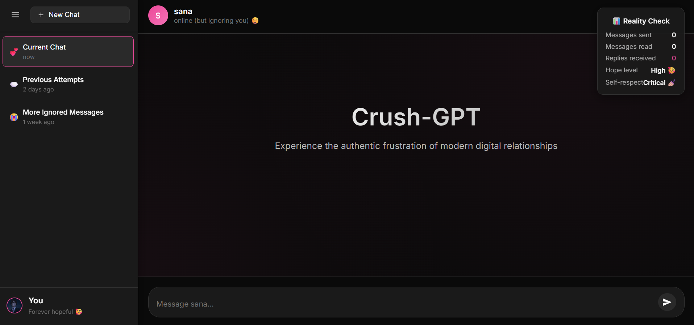

#  Crush-GPT ❤️

*Because sometimes code > courage*

Crush-GPT is a parody web project that pretends to be a chatbot, but with one twist — it never replies.  
When you open the site, it first asks you: *“What’s their name?”* so you can set the stage for your imagination.  
After that, you can type as much as you want, pour your feelings out, or just rant endlessly… and Crush-GPT will sit there quietly, staring back at you.  

The joke? That’s exactly how having a crush often feels in real life — you talk, you imagine a conversation, but they never actually respond.  
It’s not a bug, it’s the main feature.  

Think of it as the most realistic simulation of unrequited love, wrapped in the skin of a chatbot that ghosts you perfectly.  

---

## ✨ Features
- 🔤 Enter your crush's name when you first open the site  
- 🎨 Collapsible sidebar with navigation (blogs, projects, skills, fun projects)  
- 🖼️ Custom logo support (favicon + sidebar logo)  
- 💔 Never replies — for maximum realism  

---

## 🛠️ Tech Stack
- **HTML5** – structure  
- **CSS3** – styling (themes, layout, sidebar)  
- **JavaScript** – sidebar toggle & crush-name input  

---

## 📂 Project Structure
```text
root/
│── index.html        # main entry point
│── style.css         # styles (themes, layout, sidebar)
│── script.js         # sidebar + crush-name input logic
│── logo.png          # website logo / favicon
│── preview.png       # screenshot of the project
````

---

## 🚀 Getting Started

1. Clone this repo:

   ```bash
   git clone https://github.com/your-username/crush-gpt.git
   cd crush-gpt
   ```

2. Open `index.html` in your browser.

3. Enter your crush’s name, and start chatting… or not ❤️.

---

## 📸 Preview



---

## 📜 License

This project is for **fun and learning purposes only**.
Feel free to modify, experiment, and enjoy the joke.

---

💡 *Made with fun, sarcasm, and zero replies.*
